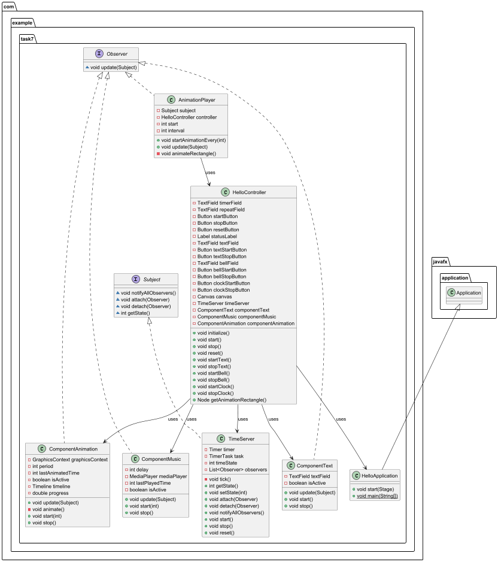

# Проект [Observer]: Time Server

## Описание

**Time Server** — это приложение на JavaFX, которое реализует паттерн проектирования **"Наблюдатель"** для управления различными компонентами (анимация, музыка, текстовый вывод) на основе текущего времени. Приложение позволяет запускать, останавливать и сбрасывать таймер, а также управлять отдельными компонентами, такими как обновление текстового поля, воспроизведение звука и анимация.

---

## Технологический стек

- **Основной язык программирования**: Java
- **Фреймворк**: JavaFX
- **Тип программного обеспечения**: Отдельное приложение

---

## Статус

**Версия 1.0** — стабильная версия с базовым функционалом.

---

## Скриншот рабочего окна приложения


---

## Что отличает этот проект от похожих

- Использование паттерна проектирования **"Наблюдатель"** для управления состоянием таймера и его компонентов.
- Гибкое управление отдельными компонентами (текст, звук, анимация).
- Простота расширения за счет добавления новых наблюдателей.

---

## Архитектура

### Диаграмма классов



---

### Назначение пакетов

- **`model`**: Содержит классы, реализующие паттерн "Наблюдатель" (например, `Observer`, `Subject`, `TimeServer`).
- **`controller`**: Содержит класс управления приложением (`HelloController`).
- **`view`**: Содержит элементы интерфейса (например, кнопки, текстовое поле, холст для анимации).

---

## Зависимости

- **Java 11 или выше**
- **JavaFX SDK**

---

## Установка

1. **Клонируйте репозиторий**:
   ```bash
   git clone https://github.com/ваш-репозиторий/ваш-проект.git
## Откройте проект в IDE

Используйте IntelliJ IDEA, Eclipse или другую среду разработки, поддерживающую JavaFX.

---

## Настройка JavaFX SDK

1. **Убедитесь, что JavaFX SDK добавлен в ваш проект.**
2. **Если вы используете IntelliJ IDEA, добавьте JavaFX SDK в качестве библиотеки.**

---

## Запуск приложения

1. **Запустите класс `HelloApplication`.**

---

## Применение

1. **Запустите приложение.**
2. **Нажмите кнопку "Запустить" (`startButton`), чтобы запустить таймер.**
3. **Используйте кнопки для управления компонентами:**
  - **`textStartButton`**: Запуск обновления текстового поля.
  - **`bellStartButton`**: Запуск воспроизведения звука.
  - **`clockStartButton`**: Запуск анимации.
4. **Наблюдайте за обновлением текстового поля, воспроизведением звука и анимацией на холсте.**
5. **Нажмите кнопку "Остановить" (`stopButton`), чтобы остановить таймер.**
6. **Нажмите кнопку "Сбросить" (`resetButton`), чтобы сбросить таймер.**

---

## Паттерн проектирования

### Наблюдатель

- **`Observer`**: Интерфейс, определяющий метод для обновления наблюдателей.
- **`Subject`**: Интерфейс, определяющий методы для управления наблюдателями.
- **`TimeServer`**: Класс, реализующий интерфейс `Subject`. Он управляет состоянием таймера и уведомляет наблюдателей об изменениях.

---

## Приглашение к сотрудничеству

Мы приглашаем всех к участию в развитии проекта. Вот несколько идей для улучшения:

- Добавление новых компонентов (например, новые типы анимаций или звуков).
- Улучшение пользовательского интерфейса.
- Реализация сохранения и загрузки состояния таймера.

Если вы хотите внести свой вклад, создайте pull request или свяжитесь с нами через систему отслеживания проблем.

---

## Информация о лицензии

Этот проект распространяется под лицензией MIT. Подробности смотрите в файле `LICENSE`.

---

## Проекты, которые вас вдохновили

- [JavaFX Documentation](https://openjfx.io/)
- [Design Patterns: Elements of Reusable Object-Oriented Software](https://www.amazon.com/Design-Patterns-Elements-Reusable-Object-Oriented/dp/0201633612)

---

## Связанные проекты

- [JavaFX Examples](https://github.com/openjfx/samples)